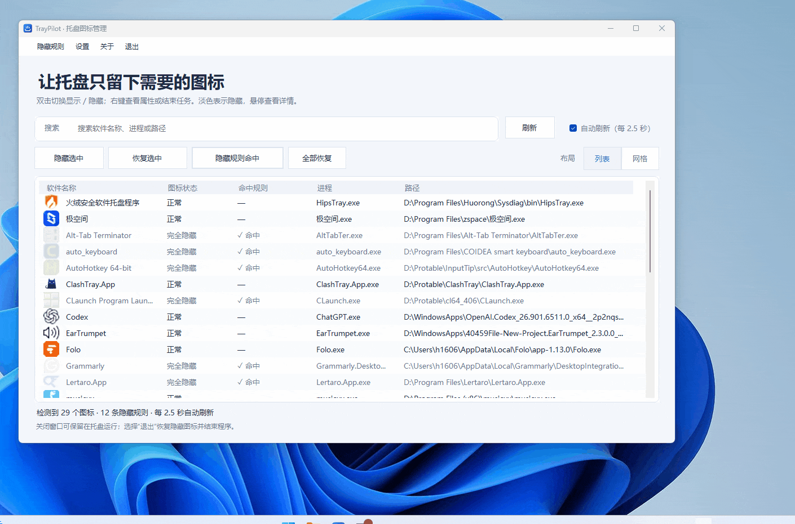

# TrayPilot

让 Windows 托盘更清爽：隐藏不需要的图标，软件照常运行。

简体中文 | [English](README.md)

## 下载与开始使用

适用于 **Windows 11 x64**，目前主要在 Windows 11 25H2 上测试。

1. 前往 [下载页面](https://github.com/HCLonely/TrayPilot/releases)，选择 **完整版（full，推荐）**；如果已安装 .NET 8 Desktop Runtime x64，也可以选择体积更小的 **精简版（lite）**。
2. 将程序解压到准备长期保存的文件夹，双击 `TrayPilot.exe`。完整版无需另装运行环境。
3. 在列表中找到不想看到的图标，**双击即可隐藏，再次双击恢复**。
4. 关闭窗口后，TrayPilot 默认继续在托盘运行；需要结束时，从菜单选择 **退出**。

隐藏的图标会同时从任务栏和折叠菜单中消失，**不会关闭对应的软件**。恢复后，图标按 Windows 原有设置回到任务栏或折叠菜单。

## 常用操作

| 我想…… | 怎么做 |
| --- | --- |
| 隐藏或恢复一个图标 | 双击该图标或所在行 |
| 批量处理图标 | 按住 Ctrl / Shift 多选，再点击 **隐藏选中** / **恢复选中** |
| 让某个图标一直隐藏 | 右键该图标，选择 **仅自动隐藏此图标** |
| 管理同一软件的所有图标 | 右键选择 **此程序的所有图标** |
| 找到某个软件 | 在搜索框输入名称或路径 |
| 取消自动隐藏 | 打开 **隐藏规则**，删除对应规则 |
| 恢复本工具隐藏的图标 | 点击 **全部恢复** |

列表和网格布局都支持双击与多选。淡化的项目表示图标已隐藏；**✓ 命中**或角标表示已设置自动隐藏规则。

右键菜单也提供 **属性** 和 **结束任务**。结束任务会关闭对应的软件，可能丢失未保存内容；只想让图标消失时，请使用隐藏功能。

## 自动隐藏与恢复

添加隐藏规则后，TrayPilot 会在运行期间自动隐藏匹配的图标。规则会保存，下次启动仍可使用。

- **暂时显示**：手动恢复某个图标，本次运行期间不会再自动隐藏它。要重新应用规则，点击 **隐藏规则命中**。
- **全部恢复**：恢复本工具隐藏的图标，保留普通软件的隐藏规则。
- **彻底取消规则**：在 **隐藏规则** 中删除对应项目。
- **退出程序**：恢复本工具隐藏的图标并退出，普通软件的规则保留供下次使用。

如果某个软件原先设置了“所有图标”规则，现在只想隐藏其中一个，请先删除原规则，再为目标图标设置 **仅自动隐藏此图标**。

列表默认每 2.5 秒自动更新。新图标或状态尚未出现时，可点击 **刷新**。关闭自动刷新不等于暂停自动隐藏。

## 托盘、开机启动与设置

点击 TrayPilot 的托盘图标可打开主界面，右键可快速切换其他软件图标的显示状态。图标较多时，使用鼠标滚轮或上一页 / 下一页翻页。

在 **设置** 中可以：

- 开启 **开机启动**，登录 Windows 后自动运行；也可直接从托盘菜单切换。
- 选择关闭窗口后继续运行，或关闭窗口时退出。
- 切换浅色、深色或跟随系统外观，以及简体中文 / English。
- 显示或隐藏 TrayPilot 自身的托盘图标。
- 启用并修改快捷键。

| 功能 | 预置快捷键（需手动启用） |
| --- | --- |
| 打开主界面 | Ctrl+Alt+M |
| 显示所有 | Ctrl+Alt+S |
| 隐藏规则命中 | Ctrl+Alt+H |

**显示所有**会显示已识别的隐藏图标并暂停自动隐藏；使用 **隐藏规则命中** 可恢复自动隐藏。快捷键冲突时，请在设置中换一个组合。

开机启动默认关闭，请通过 TrayPilot 的设置或托盘菜单管理。移动程序文件夹后，请从新位置重新启用开机启动。

## 音量、网络、时钟等系统图标

打开 **系统图标**，可管理主任务栏的音量、网络、电池、时钟、语言栏、通知铃铛、“显示桌面”等项目。双击项目即可切换显示状态，选择会自动保存。

建议保留默认的 **新版兼容方案（推荐）**。首次使用或 Windows 更新后，可能需要联网并稍等片刻。若连接失败，可稍后重试，或尝试切换识别方案。

系统图标的选择与普通软件规则分开保存。**全部恢复**和**显示所有**会清除系统图标的隐藏选择；需要再次隐藏时，请重新设置。

## 常见问题

**关闭窗口后，为什么还在运行？**

默认是关闭到托盘，方便继续自动隐藏图标。请从菜单选择 **退出**，或在设置中关闭此行为。

**把 TrayPilot 自己的图标隐藏了，怎么打开？**

再次运行 `TrayPilot.exe`，即可唤回已有窗口；也可以使用已启用的“打开主界面”快捷键。

**软件还在运行，但列表里没有它？**

先确认它本身有托盘图标，再点击 **刷新**。部分特殊软件可能无法识别。音量、网络、时钟等请在 **系统图标** 中管理。

**程序意外关闭后，图标没有回来怎么办？**

重新打开 TrayPilot，点击 **全部恢复**；也可以重启对应的软件。在图标恢复前，请保留 TrayPilot 的设置文件。

**能管理其他 Windows 版本或副屏吗？**

目前主要面向 Windows 11 25H2 x64，系统图标功能针对主任务栏。其他版本、副屏和 ARM64 尚未充分验证；Windows 更新也可能影响兼容性。

遇到其他问题，可在 [Issues](https://github.com/HCLonely/TrayPilot/issues) 反馈，并附上 TrayPilot 版本、Windows 版本及复现步骤。

## 开发与致谢

编译、诊断、语言包和实现说明见 [开发文档](docs/DEVELOPMENT_CN.md)。

系统图标功能参考了 Windhawk 的 [Taskbar tray system icon tweaks](https://github.com/ramensoftware/windhawk-mods/blob/main/mods/taskbar-tray-system-icon-tweaks.wh.cpp)，感谢原作者的工作。
